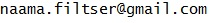
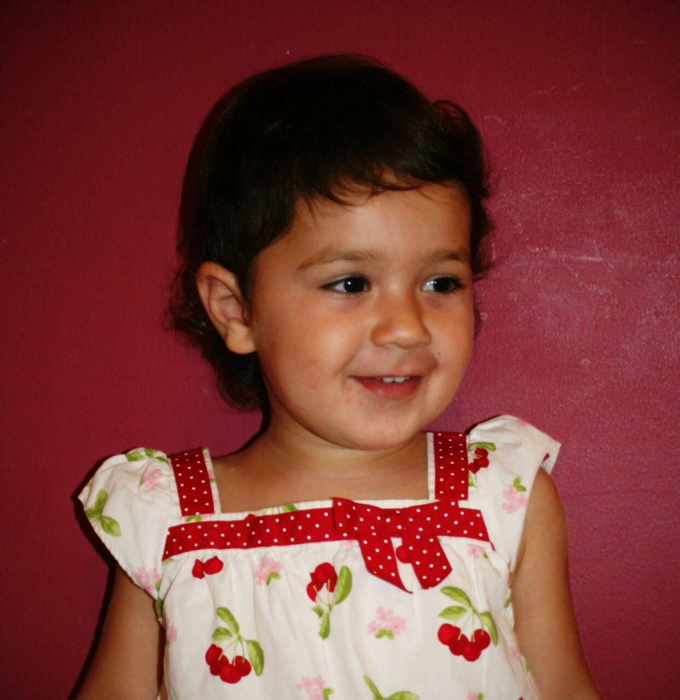
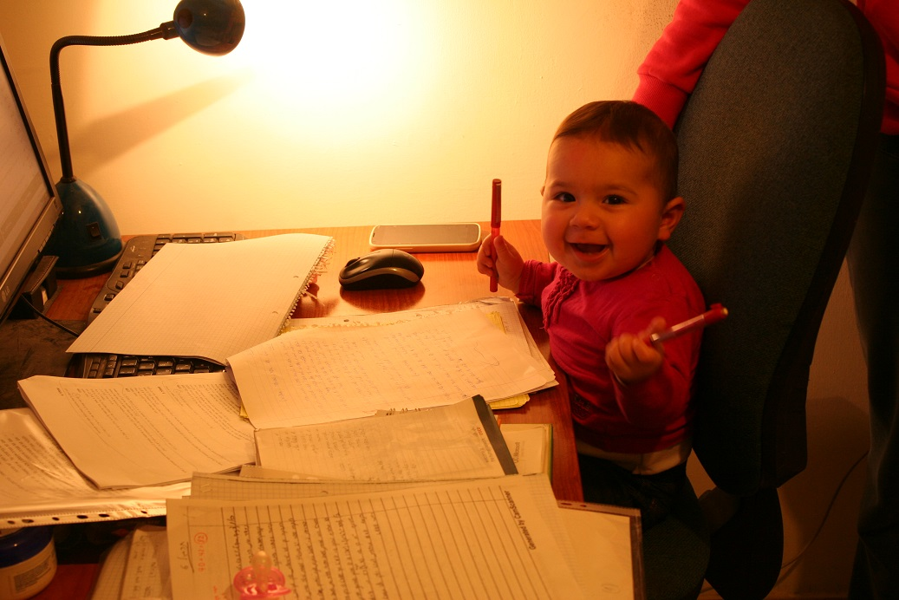
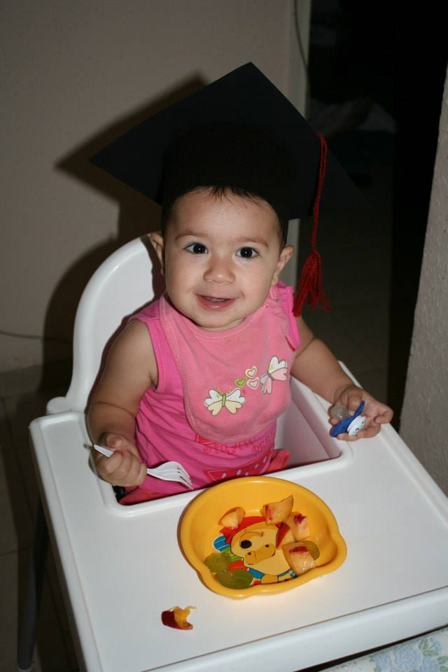
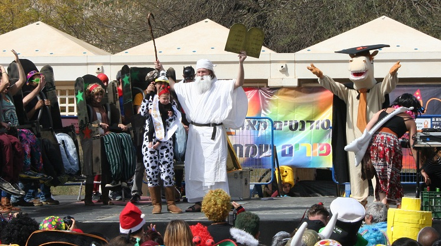
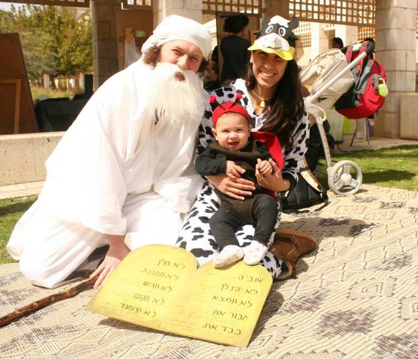

<!DOCTYPE html>
<html lang="en">
  <head>
    <meta charset="utf-8">
    <title>Naama Filtser - Personal Page</title>
    <meta name="viewport" content="width=device-width, initial-scale=1.0">
    <meta name="description" content="">
    <meta name="author" content="">

    <!-- Le styles -->
    <link href="./css/bootstrap.css" rel="stylesheet">
	
	<link href="./css/bootstrap-responsive.css" rel="stylesheet">
    
    

    <!-- Le HTML5 shim, for IE6-8 support of HTML5 elements -->
    <!--[if lt IE 9]>
      
    <![endif]-->

    <!-- Le fav and touch icons -->
    <link rel="shortcut icon" href="./ico/favicon.ico">
  </head>

  <body>
	

		

			

			
				

				  

					<a class="brand" href="./">Naama Filtser</a>
					<ul class="nav" id="myTab">
					  <li class="active"><a href="#home">Home</a></li>
					  <li><a href="#tab1">Teaching</a></li>
					  <li><a href="#tab2">Education</a></li>
					  <!-- <li><a href="#tab3">Publications</a></li> -->
					  <li><a href="#tab4">Honors</a></li>
					  <li><a href="#tab5">Personal</a></li>
					  <!-- <li><a href="#tab6">Tab 6</a></li> -->
					  <!-- <li><a href="#tab7">Tab 7</a></li> -->
					  <!-- <li><a href="#tab8">Tab 8</a></li> -->
					  
					</ul>
				  

				

				

					

						

							

								<h3>About Me</h3>
								

									I am a student at the Ruth&Shlomo kindergarten at Be'er Sheva.  
									My advisors are 
									<a href="http://www.cs.bgu.ac.il/~omritna/" target="_blank">Mom</a> and 
									<a href="http://www.cs.bgu.ac.il/~arnoldf/" target="_blank">Dad</a>.
								

								

								My research interest is in variety of areas, including but not restricted to:
								basic laws of mechanics, languages and linguistics, social relationships and manipulations, convex objects and counting.
								
 
								

								<h3>Contact information</h3>
								<address>
									<strong>Naama Filtser</strong> 
									Beer-Sheva, Israel. 
									<strong>Office: </strong>TBA 
									<strong>Phone: </strong>TBA 
									<strong>Email: </strong> 
									<strong>Office hours: </strong>TBA 
								</address>
								

				
						
							

							

								
							

						

					

					
					
					

						

							

								<H2>Teaching</H2>
								

									Currently I'm grading homework and exams in variety of courses. For arranging checking ease, you may send me sweets and cookies with your details.
								
	
				
							

							

								
							
							
						

					
					

					
				
					
					

						<H2>Education</H2>
						

							I graduated from the first and second year at Ruth&Shlomo kindergarten, summa cum laude (of course).
						

						

							
						

					

					
					
					

						<H2>Publications</H2>
						<ul class="unstyled">	
						<ul>
					

					
					
					

						<H2>Honours</H2>
							<ul>
								<li><a href="https://www.cs.bgu.ac.il/~arnoldf/#tab6"> "Best Relative Award"</a>, 2014. The award is given by the "Filtser Family" cooperation.</li>
								<li>"Judges favourite" prize in the Purim costume contest of BGU student union.  
									I received the honour together with my  <a href="http://www.cs.bgu.ac.il/~omritna/" target="_blank">Mom</a> and <a href="http://www.cs.bgu.ac.il/~arnoldf/" target="_blank">Dad</a>.
								</li>
							</ul>
									

										
									

									

										
									

					

					
					

						

							

								<H2>Personal</H2>
								

									During my free time I like drawing, swimming, dancing, cycling and playing with dolls. 
								
	
								

									A sample of cool Balkan (and neighbours) music:
									<ul>
										<li><a href="https://www.youtube.com/watch?v=EK-2I_aXAyk" target="_blank">Goran Bregovic.</a> </li>
										<li><a href="https://www.youtube.com/watch?v=wA3fV3QRvvU" target="_blank">Boom Pam.</a> </li>
										<li><a href="https://www.youtube.com/watch?v=bGA2ivN4WBU" target="_blank">Shantel.</a> </li>
										<li><a href="https://www.youtube.com/watch?v=sOg6LkCaA38" target="_blank">Amsterdam Klezmer Band.</a> </li>
										<li><a href="https://www.youtube.com/watch?v=Ig8m5uxRvhk" target="_blank">Zdob si Zdub.</a> </li>	  
									</ul>
								

								<iframe src="https://docs.google.com/spreadsheets/d/e/2PACX-1vT_xhFAHuSjVx3TOlxibwlWBMM936oIifRX-VPtE4fYZbjeJWJaayxdYjn0vlwtRa01xd0-f6q2lLx1/pubhtml?gid=124166413&amp;single=true&amp;widget=true&amp;headers=false"></iframe>
							
												
						

					

					
					

						<H2>Tab 6</H2>
						

							An extra tab you can use for whatever purpose you see fit. Rename/Hide this tab  by editing the <code>#navbar</code> section of the index.html.
						

					

					

						<H2>Tab 7</H2>
						

							An extra tab you can use for whatever purpose you see fit. Rename/Hide this tab  by editing the <code>#navbar</code> section of the index.html.
						

					

					

						<H2>Tab 8</H2>
						

							An extra tab you can use for whatever purpose you see fit. Rename/Hide this tab  by editing the <code>#navbar</code> section of the index.html.
						

					

				
<!-- tab content-->
			
 <!-- /main span -->
		
 <!-- /container -->
		

	
 <!-- /wrap -->
	
    

		

			
Bootstrapped personal page theme by <a href="http://www.cs.bgu.ac.il/~boazar" rel="author">Boaz Arad</a>, get yours <a href="http://www.cs.bgu.ac.il/~boazar/#tips">here

      

      
      <h1 class="hidden" align="center">
		<!-- <h1 class="hidden">-->
		<!-- hitwebcounter Code START -->
		<!-- 
		<!-- hitwebcounter Code START -->
                 
        </h1>
        <h1 class="hidden" align="center">
		<!-- <h1 class="hidden">-->
		<!-- hitwebcounter Code START -->
		<!-- 
		<!-- hitwebcounter Code START -->
                 
        </h1>
        <h1 class="visible" align="center">
                

                
                

        </h1>
  
	

    <!-- Le javascript
    ================================================== -->
    <!-- Placed at the end of the document so the pages load faster ->
    
    
    
    
    
    
    
    
    
    
    
    
    -->
	
	
	

  </body>
</html>
